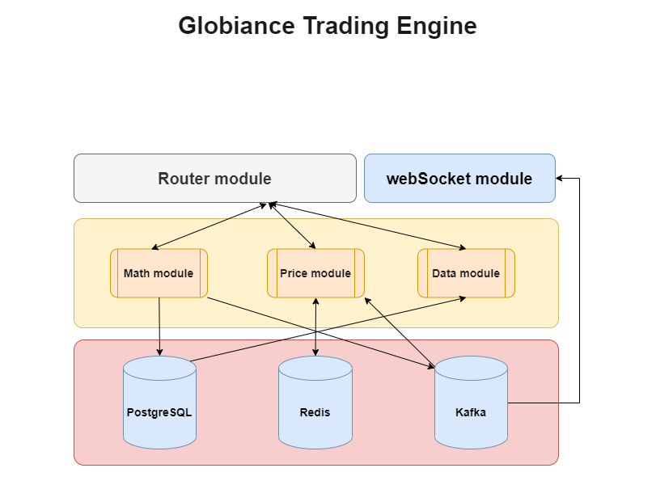

# Table of Contents
- [Table of Contents](#table-of-contents)
- [Getting started](#getting-started)
	- [What is a trading engine? Introduction to computer driven markets.](#what-is-a-trading-engine-introduction-to-computer-driven-markets)
	- [Matching engine](#matching-engine)
	- [Order book](#order-book)
	- [Order types](#order-types)
		- [Limit order](#limit-order)
		- [Market order](#market-order)
- [Globiance Trading Engine](#globiance-trading-engine)
	- [Tech stack](#tech-stack)
	- [Overall structure](#overall-structure)
	- [PostgreSQL database](#postgresql-database)
		- [Table balance_history](#table-balance_history)
		- [Table order_history](#table-order_history)
		- [Table `deal_history`](#table-deal_history)
	- [Deployment](#deployment)
		- [Prerequisites](#prerequisites)
		- [Setup](#setup)
		- [Start](#start)
		- [Start in dev mode](#start-in-dev-mode)
		- [Start on offline server](#start-offline)
		- [Stop the system](#stop-the-system)
- [Terminology](#terminology)
- [References](#references)

<a name="getting-started"></a>
# Getting started 


<a name="introduction"></a>
## What is a trading engine? Introduction to computer driven markets. 
A  **cryptocurrency exchange**, or a **digital currency exchange**  (**DCE**), is a business that allows customers to trade cryptocurrencies or  digital currencies for other assets, such as conventional fiat money or other digital currencies. Exchanges may accept credit card payments, wire transfers or other forms of payment in exchange for digital currencies or cryptocurrencies. A cryptocurrency exchange can be a market maker that typically takes the bid–ask spreads as a transaction commission for is service or, as a matching platform, simply charges fees.

A **trading engine** is the heart of the crypto exchange. This is an electronic system that collects all open buy and sell orders and matches them, thus executing transactions.

Open orders are placed in the **order book**, where buy and sell orders are sorted by price and time. Thus, the transaction can be executed if the supply matches the demand, otherwise it can be canceled.	

How does the trading engine work? Algorithms collect information about all open orders, and if two opposite orders are equal, they are executed and the transaction is completed. These algorithms also allow you to place market, limit and stop limit orders.

The performance of the engine determines the overall efficiency and reliability of the exchange, its characteristics and the order matching system.

<a name="matchengine"></a>
## Matching engine

A **matching engine** is the most important part of any trading engine that receives new orders and generates new trades if the two orders can be fulfilled by each other.

<a name="order-book"></a>
## Order book 
The **order book** is a list of buy or sell orders sorted by price and timestamp.

When a new order is received, it is checked against the other side of the market (for a new buy order we check the sell orders) to see if there are any orders matching the conditions imposed by the new order. If this is the case, then we generate trades between the orders until the conditions are invalidated or until the order is filled.

The **order book** consists of the orders at the heads of the queues. These orders represent the current best prices for bids and asks. Market prices are set either by the market open prices or by limit orders. Market orders have no target price, so they cannot define price in the market.

<a name="order-types"></a>
## Order types
Electronic trading networks support a variety of order types, some of which are customized to favor certain market participants. 

<a name="limit-orders"></a>
### Limit order
Limit orders are the most commonly used orders in the current crypto exchange environment.

They allow you to create an order with a specific price that gets filled either at the specified price better.

For a buy order, this means that if I place a buy order at the price of $100, it will get filled at any price bellow or equal to $100. As a sell order it will instead get filled at an amount above or equal to $100.

Limit orders are sorted:
-   Buy orders are sorted in descending order by their bid price and ascending order by time stamp for orders that have the same price. Orders with the highest bid (buy) price are kept at the top of the queue and will be executed first. For equal priced bids, the order that arrives first is executed first.
-   Sell orders are sorted in ascending order by their ask price, and like buy orders, by ascending order by time stamp for orders with the same price. Orders with the lowest sell (ask) prices will be sold first. For orders with the same ask price, the order that arrives first will be sold first.

<a name="market-orders"></a>
### Market order
An order to buy or sell at the best available price at the time the order is submitted. Market orders prioritize completing the order for the specified amount ignoring the price completely. They have a priority in the order book and they guarantee fulfillment in markets with sufficient liquidity.

For example, when you place a  _buy 2 Ether_  order it can get executed at $900, $1000, $2000 or any other price depending on the current open orders in the market. Market orders are limited only by the number of funds the user has and the amount of assets he wants to buy/sell.


<a name="globiance-trading-engine"></a>
# Globiance Trading Engine

**Globiance Trading Engine** is a trading backend with high-speed performance, for cryptocurrency exchanges. It can support up to about 100 000 trades every second and real-time user/market data notification through websocket.

Typical exchanges use relational database for their trade matching machine. The advantage is that it can rapidly realize business logic and guarantee data accuracy and reliability using data-dependent index, transaction etc. mechanisms. But it would also invite problems to the database and result in poor performance. With the development of quantitative trading, an increasing number of orders are now processed systematically and most of them are high-frequency trading with large order quantity which requires high standard for transaction interface delay. In order to break through the bottlenecks of database performance, we have chosen single process to avoid spending on database transactions and locks, and memory calculation to avoid spending on data persistence in return of significant performance improvement.

<a name="tech-stack"></a>
## Tech stack
-   PostgerSQL: for saving operation log, user balance history, order history and trade history.
-   Redis: is for saving market data.
-   Kafka: a message system.

<a name="overall-structure"></a>
## Overall structure

We create 5 services: 
- Math (matchengine);
- Price (marketprice);
- Data (readhistory);
- Router (router);
-  WebSocket (websocket).

Between themselves and external services, they will communicate through a **Router**. Using **WebSocket**, we will notify external services (current prices, order book, etc.)

The **Math** module will execute user orders, record the transaction log, user balance history, order history and trading history. We will store this data in PostgreSQL.

After receiving a new order, it will first write to the database and send it to Kafka, which will then send it to the **Price** module and to **WebSocket**.
**Price** module works with market data (current prices, order book). We store market data in Redis so that you can get access to it as quickly as possible. 

Having received a new order from Kafka, it will find overlapping orders in redis and send them through the router to the **Math** module, which will execute them and update them in the database and add them to the Kafka queue, which in turn will send everything via sockets to external services

**Data** module reads data of orders, history balances from PostgreSQL.
Such a structure will give us a high speed of order execution, possibility of horizontal scaling, plus a guarantee that there will be no conflicts related to database transactions.

<a name="postgres"></a>
## PostgreSQL database 
`trade_history` database is created with three empty tables: `balance_history`, `order_history`,  `deal_history`. 

<a name="balance_history"></a>
### Table balance_history

This table has a history of user's balances. 

Most important fields:

An ID of balance owner

```
"user_id: SERIAL NOT NULL PRIMARY KEY,
```

A name of asset to keep the balance of. Something like "BTC", "ETC", etc.

```
"asset" VARCHAR(4) NOT NULL,
```

A vague info about the reason of the balance change. The usual values are "deposit", "withdraw" and "trade", but others are possible.

```
"business" VARCHAR(30) NOT NULL,
```

The difference between the recorded balance amount and the previous one

```
"change" DECIMAL(30,8) NOT NULL,
```

The last recorder at the time balance

```
"balance" DECIMAL(30,16) NOT NULL,
```

An arbitrary detail info passed alongside with the balance change operation request
```
"detail" TEXT NOT NULL
```

<a name="order_history"></a>
### Table order_history

Most important fields:

A time the order has been opened and either filled or canceled
```
"create_time" TIMESTAMP NOT NULL,
"update_time" TIMESTAMP NOT NULL,
```

An id of the user who created the order

```
"user_id" SERIAL NOT NULL,
```

A "market" (concatenation of assests to be exchnaged) name
```
"market" VARCHAR(7) NOT NULL,
```

1 - for "buy" and 2 for "sell" orders

```
"side" SMALLINT NOT NULL,
```

Price of "stock" is expressed in "money" currency

```
"price" DECIMAL(30,8) NOT NULL,
```
The total amount of the assets (i.e. price * quantity) used for the order

```
"amount" DECIMAL(30,8) NOT NULL,
```

An amounts of the deal is the amount of the order minus the fee(s) expressed in stock amd money currency

```
"deal_stock" DECIMAL(30,8) NOT NULL,
"deal_money" DECIMAL(30,16) NOT NULL,
```

The total fee of taker's and maker's fees

```
"deal_fee" DECIMAL(30,16) NOT NULL
```
<a name="deal_history"></a>
### Table `deal_history`
This table has a history of deals (matched orders). 

<a name="deployment"></a>
## Deployment
### Prerequisites

Install [Docker](https://www.docker.com/) on your system.

* [Install instructions](https://docs.docker.com/installation/mac/) for Mac OS X
* [Install instructions](https://docs.docker.com/installation/ubuntulinux/) for Ubuntu Linux
* [Install instructions](https://docs.docker.com/installation/) for other platforms

Install [Docker Compose](http://docs.docker.com/compose/) on your system.

* Python/pip: `sudo pip install -U docker-compose`
* Other: ``curl -L https://github.com/docker/compose/releases/download/1.1.0/docker-compose-`uname -s`-`uname -m` > /usr/local/bin/docker-compose; chmod +x /usr/local/bin/docker-compose``

<a name="setup"></a>
### Setup

Create `.env` file in each module folder following `sample.env`. Run: 
```bash
docker-compose build
```
It will build the containers for each one of trading engine [services](#overall-structure).

<a name="start"></a>
### Start

To create and start the trading engine containers run:
```bash
docker-compose up
``` 
The services can be run on the background with command:
 ```bash
 docker-compose up -d
 ``` 
To see logs of specific service in background mode use command:
 ```bash
 docker logs --follow *container_name*
 ```
 Run `docker ps` to see all containers info.

<a name="start-dev"></a>
### Start in dev mode
To start services in development mode with nodemon just run 
```bash
docker-compose -f docker-compose-dev.yml -p *your_username* up -d
```

<a name="start-offline"></a>
### Start on offline server
To start services on offline server you should download [docker engine packages](https://docs.docker.com/engine/install/ubuntu/#install-from-a-package), move them to the target server, and install them manually. Then you need to install [docker compose as standalone binary](https://docs.docker.com/compose/install/#install-compose-as-standalone-binary-on-linux-systems) also manually.

After Docker is installed, you need to build images of the current version of the trading engine on a server with Internet access.

```bash
docker-compose build
```

Next, you need to export the built docker images into single tar file:

```bash
docker save $(docker images --format '{{.Repository}}:{{.Tag}}') -o te_images.tar
```

After that, you need to move this tar file to the target server:

```bash
scp ./te_images.tar <username>@<host>:~/te_images.tar
```
And load images from the tar archive. It restores both images and tags:

```bash
docker load -i te_images.tar
```

Then it's enough just to run the containers using a special `docker-compose-offline.yml` file:
```bash
docker-compose -f docker-compose-offline.yml up -d
```

<a name="stop"></a>
### Stop the system
Stopping all the running containers is also simple with a single command:
```bash
docker-compose down
```
If you need to stop and remove all containers, networks, and all images used by any service in  _docker-compose.yml_  file, use the command:
```bash
docker-compose down --rmi all
```

<a name="terminology"></a>
# Terminology
The terms to be used during the tables description without further explanations.
* `Exchange` - (usually "the Exchange") the set of the software providing assets exchange functionality and
use the databases to perstist the interanal state.
* `Asset` - in the scope of the Exchange the asset means nothing more than a name of the crypto currency.
* `Money` - an asset an user usually "owns" (or borrow) and may "sell" (or put "ask" limit order) in exchange of the
another asset called "stock".
* `Stock` - in the simplest case, an asset to be suggested by the market for the exchange to "money". Stock
is the currency an user may "buy" (or put "bid" limit order) in exchange of the "money" he owns.
* `Market` - a 6 or 7 characters long string concatenation of "Stock" and "Money".
* `Bid` – the price in a buy order.
* `Ask` – the price in a sell order.
* `Spread` – the gap between the bid and the ask price.
* `user_id` - an ID of exchange user sometimes referred as "exchange id" meaning "an id of the exchange user".

<a name="references"></a>
# References
1. **Globiance Trading Engine** architecture inspired by [_ViaBTC Exchange Server_](https://github.com/viabtc/viabtc_exchange_server) (C programming language).
2. [_How to Build a Trading Engine_](https://around25.com/blog/building-a-trading-engine-for-a-crypto-exchange/) (Go)
3. [_Algo Trading Platform (Trading Engine) Series_](https://www.youtube.com/watch?v=BUG7Mv-sPIY&list=PLIkrF4j3_p-3fA9LyzSpT6yFPnqvJ02LS) (C#)

